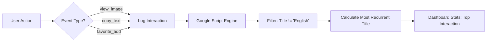

# 📸 FD Screenshot Assistant


[](https://react.dev/)
[](https://vitejs.dev/)
[](https://pages.github.com/)
[](https://script.google.com/)
[](https://opensource.org/licenses/MIT)

> **Enterprise Screenshot Management & Behavioral Intelligence | Version 2.5.0**  
> A premium, high-performance dashboard architected for institutional content libraries. Featuring glassmorphism aesthetics, **Atomic GitHub Synchronization**, and **v8.1 Behavioral Analytics**.

---

## ✨ Core Features

*   **💎 Premium UI/UX**: Immersive "Modern Dark" aesthetic using glassmorphism, gold/neon accents, and interactive Recharts visualizations.
*   **📊 Advanced Analytics (v8.1)**: **New.** Real-time interaction tracking with automated "Top Interaction" calculation, filtering out generic labels to focus on specific content engagement.
*   **⚛️ Atomic Sync Engine**: Conflict-resistant CRUD operations via a "Fetch-Modify-Commit" cycle, ensuring data integrity in collaborative environments.
*   **⏰ Temporal Enforcement**: Automatic `updatedAt` injection with intelligent timezone offsets (UTC+8 for Asia-region content, UTC+0 for global).
*   **🔍 Semantic Search**: Instant-result fuzzy matching powered by Fuse.js across multi-language titles and technical content.
*   **🌍 Intelligent Localization**: Robust support for EN, CN, TR, AR, RU, and VI, including dynamic UI label resolution based on content context.
*   **🧠 Identity Resolution v8.1**: Advanced canvas fingerprinting and hardware telemetry to resolve unique devices without intrusive tracking.

---

## 🗺️ Engineering Architecture

```text
support-screenshot-library-main/
├── .github/                # CI/CD Workflows & Deployment Logic
├── public/                 # Production Assets
│   ├── screenshots/        # Auto-synced Image Repository
│   ├── hero-branding.png   # Project Visual Identity
│   └── fd-logo.svg         # Platform Branding
├── src/                    # Application Source
│   ├── components/         # Atomic UI Components
│   │   ├── Layout.jsx      # Core Shell & Global State
│   │   ├── AnalyticsPage.jsx # v8.1 Insight Dashboard
│   │   └── ScreenshotCard.jsx # Interaction Entry Point
│   ├── services/           # External Modules
│   │   ├── analytics.js    # Behavioral Tracking & Script Bridge
│   │   └── github.js       # Atomic Sync & API Layer
│   ├── contexts/           # Persistence & State
│   └── data/               # Persistent Storage (data.json)
├── backfill.cjs            # Maintenance CLI for Data Normalization
└── DEPLOYMENT.md           # Production DevOps Playbook
```

---

## 🧠 Technical Deep Dive

### 1. Interaction Tracking Logic (v8.1)
The analytics engine now distinguishes between "Metadata" (languages, topics) and "Interactions" (clicks, copies, views).



### 2. Atomic Synchronization Engine
To prevent data loss, the platform uses a strict SHA-verified commit flow:

1.  **Poll**: Fetch current `data.json` and its unique SHA from GitHub.
2.  **Mutate**: Apply local changes (Add/Edit/Delete) to the fresh state.
3.  **Commit**: Send the update back to GitHub. If the SHA has changed remotely since the Poll, the commit is rejected to prevent overwriting peer work.

---

## 🚀 Getting Started

### Prerequisites
- Node.js (v18+)
- npm / pnpm

### Quick Install
```bash
git clone https://github.com/GorkemTikic/screenshot-library.git
cd screenshot-library
npm install
npm run dev
```

### Admin Configuration
To enable the **GitHub Sync** bridge:
1.  Obtain a **GitHub PAT (Personal Access Token)** with `repo` scopes.
2.  Enter the token in the **Admin Settings** to authorize atomic commits.

---

## 🛠️ Maintenance & CLI

**Data Backfilling**: Ensure all entries have valid timestamps and timezone resolution.
```bash
node backfill.cjs
```

**Production Build**:
```bash
npm run build
npm run deploy  # Automated GitHub Pages Deployment
```

---
*Documented with excellence by Antigravity for the FD Ecosystem 🚀*
