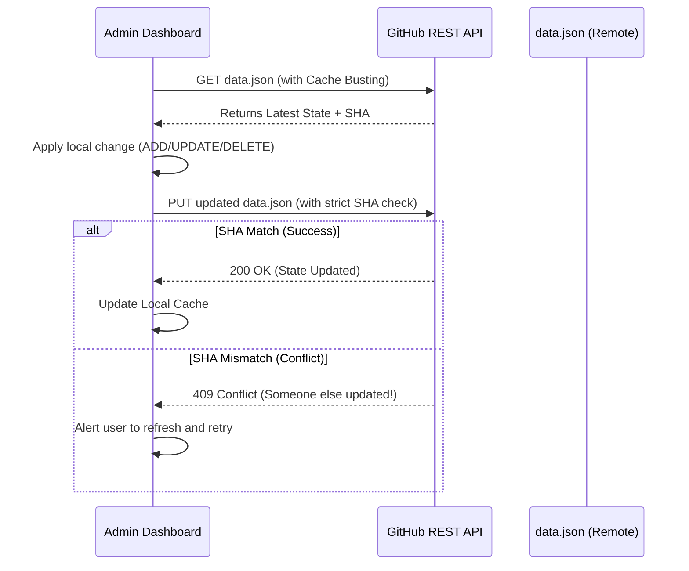

# 📸 Screenshot Library Assistant

[](https://react.dev/)
[](https://vitejs.dev/)
[](https://pages.github.com/)
[](https://opensource.org/licenses/MIT)

> **Senior Technical Architecture Map | Version 2.0.0**  
> A premium, high-performance dashboard for institutional screenshot management. Featuring glassmorphism aesthetics, **Atomic GitHub Synchronization (Conflict-Resistant)**, and advanced identity resolution.

---

## ✨ Core Features

*   **💎 Premium UI/UX**: Built with a "Modern Dark" aesthetic using glassmorphism, neon accents, and smooth Framer Motion animations.
*   **⚛️ Atomic Sync (v2.0)**: **New & Improved.** All CRUD operations now follow an atomic "Fetch-Modify-Commit" cycle, preventing data loss in collaborative environments.
*   **🔍 Semantic Search**: Instant results powered by Fuse.js for high-performance fuzzy matching across titles and content.
*   **📊 Insightful Analytics**: Interactive data visualization using Recharts, tracking trends in content distribution and user interactions.
*   **🧠 Identity Resolution v8.0**: Advanced canvas fingerprinting and hardware telemetry to track unique physical devices across sessions.
*   **🌍 Intelligent Localization**: Dynamic language handling with automated timezone offsets (e.g., UTC+8 for Chinese entries).

---

## 🗺️ Project Structure

```text
support-screenshot-library-main/
├── .github/                # CI/CD Workflows & GitHub Actions
├── public/                 # Static Assets
│   ├── screenshots/        # Screenshot Repository (Auto-synced)
│   └── fd-logo.svg         # Platform Branding
├── src/                    # Source Code
│   ├── components/         # Modular UI Components
│   │   ├── Layout.jsx      # Core Application Shell
│   │   ├── Lightbox.jsx    # Immersive Image Preview
│   │   ├── ScreenshotCard.jsx# Item Display & Interaction Logic
│   │   └── ...             # Specialized sub-components
│   ├── contexts/           # State Management (Data, Theme)
│   ├── data/               # Persistent Storage
│   │   └── data.json       # Centralized JSON Database
│   ├── pages/              # View Layers (Home, Admin, Analytics)
│   ├── services/           # Integration Layer (GitHub API, Analytics)
│   └── utils/              # Helper Libraries (Time, Image, Language)
├── backfill.cjs            # Maintenance script for timestamp population
├── DEPLOYMENT.md           # Engineering Playbook for Production
└── package.json            # Deployment Manifest & Dependencies
```

---

## 🧠 Technical Architecture

### 1. Atomic Synchronization Engine (v2.0)
To prevent the "Lost Update" problem common in collaborative JSON management, the platform now enforces an atomic state transition:



### 2. Dual-Source Data Strategy
-   **Public Facing**: Pulls from GitHub Raw CDN for maximum speed, leveraging edge caching.
-   **Admin Panel**: Pulls directly from the API with `?t=timestamp` param to bypass CDN lag, ensuring you always edit the most recent version.

### 3. Hardware Fingerprinting (v8.0)
The system employs **Heuristic Fingerprinting** to maintain session continuity:
-   **Canvas/WebGL Rendering**: Deep device analysis via rendering variations.
-   **Network Telemetry**: Incorporates environment-specific flags into a persistent `deviceHash`.

---

## 🚀 Getting Started

### Prerequisites
- Node.js (v18+)
- npm

### Installation
```bash
# Clone the repository
git clone https://github.com/GorkemTikic/screenshot-library.git

# Install dependencies
npm install

# Start development server
npm run dev
```

### GitHub Configuration
To enable the **Admin Panel** sync features:
1.  Generate a **GitHub Personal Access Token (Classic)** with `repo` scopes.
2.  Navigate to **Admin > Settings** in the dashboard and input your token.
3.  All saves will now be handled atomically via the GitHub API.

---

## 🛠️ Maintenance & Deployment

### Data Backfilling
Run this after manual JSON edits to ensure all entries have proper ISO/Locale timestamps:
```bash
node backfill.cjs
```

### Deployment Flow
```bash
# Push logic updates to GitHub Pages
npm run deploy
```

---
*Architected and documented with precision by Antigravity 🚀*
