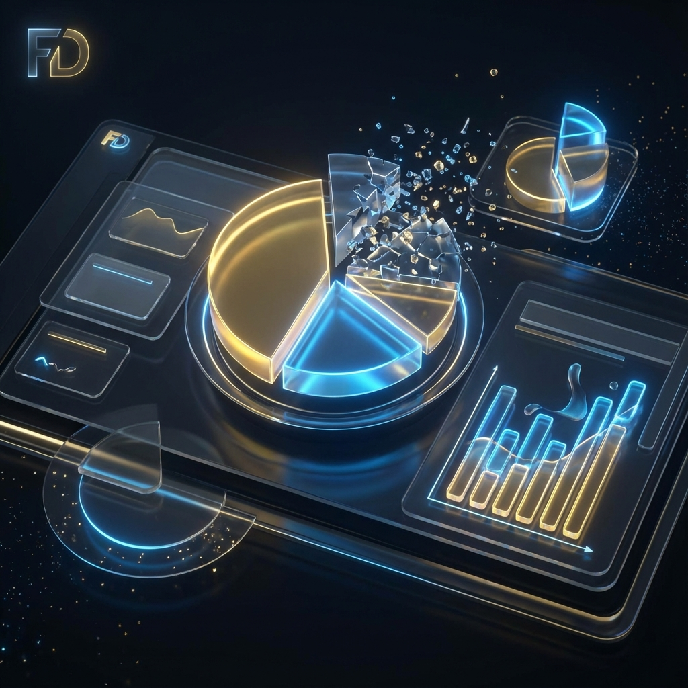
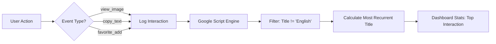
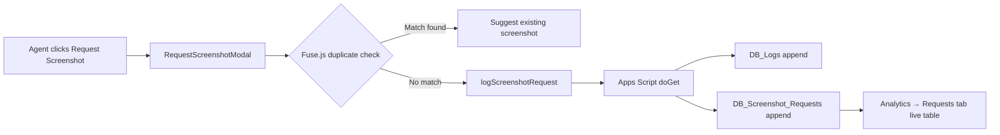

# 📸 FD Screenshot Assistant



[](https://react.dev/)
[](https://vitejs.dev/)
[](https://pages.github.com/)
[](https://script.google.com/)
[](https://opensource.org/licenses/MIT)

> **Enterprise Screenshot Management & Behavioral Intelligence | Version 2.6.0**  
> A premium, high-performance dashboard architected for institutional content libraries. Featuring glassmorphism aesthetics, **Atomic GitHub Synchronization**, **v8.2 Behavioral Analytics**, and a universal **Screenshot Request Pipeline**.

---

## ✨ Core Features

*   **💎 Premium UI/UX**: Immersive "Modern Dark" aesthetic using glassmorphism, gold/neon accents, and interactive Recharts visualizations.
*   **📊 Advanced Analytics (v8.2)**: Real-time interaction tracking with automated "Top Interaction" calculation, filtering out generic labels to focus on specific content engagement.
*   **📮 Screenshot Request Pipeline**: **New.** Agents submit missing-screenshot requests straight from the header or a zero-results state — no PAT required. Requests stream into a dedicated `DB_Screenshot_Requests` tab and surface live in the Analytics dashboard.
*   **⚛️ Atomic Sync Engine**: Conflict-resistant CRUD operations via a "Fetch-Modify-Commit" cycle, ensuring data integrity in collaborative environments.
*   **⏰ Temporal Enforcement**: Automatic `updatedAt` injection with intelligent timezone offsets (UTC+8 for Asia-region content, UTC+0 for global).
*   **🔍 Semantic Search**: Instant-result fuzzy matching powered by Fuse.js across multi-language titles and technical content — now reused to surface duplicates during request submission.
*   **🌍 Intelligent Localization**: Robust support for EN, CN, TR, AR, RU, and VI, including dynamic UI label resolution based on content context.
*   **🧠 Identity Resolution v8.1**: Advanced canvas fingerprinting and hardware telemetry to resolve unique devices without intrusive tracking.

---

## 🗺️ Engineering Architecture

```text
support-screenshot-library-main/
├── .github/                # CI/CD Workflows & Deployment Logic
├── public/                 # Production Assets
│   ├── screenshots/        # Auto-synced Image Repository
│   ├── hero-branding.png   # Project Visual Identity
│   └── fd-logo.svg         # Platform Branding
├── src/                    # Application Source
│   ├── components/         # Atomic UI Components
│   │   ├── Layout.jsx      # Core Shell & Global State
│   │   ├── ScreenshotCard.jsx       # Interaction Entry Point
│   │   └── RequestScreenshotModal.jsx # Missing-screenshot submission form
│   ├── pages/
│   │   └── AnalyticsPage.jsx        # v8.2 Insight Dashboard (Overview + Requests tab)
│   ├── services/           # External Modules
│   │   ├── analytics.js    # Behavioral Tracking, Request Submission & Script Bridge
│   │   └── github.js       # Atomic Sync & API Layer
│   ├── contexts/           # Persistence & State
│   │   └── RequestModalContext.jsx  # Cross-component modal controller
│   └── data/               # Persistent Storage (data.json)
├── backfill.cjs            # Maintenance CLI for Data Normalization
└── DEPLOYMENT.md           # Production DevOps Playbook
```

---

## 🧠 Technical Deep Dive

### 1. Interaction Tracking Logic (v8.1)
The analytics engine now distinguishes between "Metadata" (languages, topics) and "Interactions" (clicks, copies, views).


```mermaid
graph LR
    A[User Action] --> B{Event Type?}
    B -->|view_image| C[Log Interaction]
    B -->|copy_text| C
    B -->|favorite_add| C
    C --> D[Google Script Engine]
    D --> E[Filter: Title != 'English']
    E --> F[Calculate Most Recurrent Title]
    F --> G[Dashboard Stats: Top Interaction]
```

### 2. Atomic Synchronization Engine
To prevent data loss, the platform uses a strict SHA-verified commit flow:

1.  **Poll**: Fetch current `data.json` and its unique SHA from GitHub.
2.  **Mutate**: Apply local changes (Add/Edit/Delete) to the fresh state.
3.  **Commit**: Send the update back to GitHub. If the SHA has changed remotely since the Poll, the commit is rejected to prevent overwriting peer work.

### 3. Screenshot Request Pipeline
Any agent can flag a missing screenshot without credentials. The submission fans out through the same Apps Script endpoint that powers analytics:


```mermaid
graph LR
    A[Agent clicks Request Screenshot] --> B[RequestScreenshotModal]
    B --> C{Fuse.js duplicate check}
    C -->|Match found| D[Suggest existing screenshot]
    C -->|No match| E[logScreenshotRequest]
    E --> F[Apps Script doGet]
    F --> G[DB_Logs append]
    F --> H[DB_Screenshot_Requests append]
    H --> I[Analytics → Requests tab live table]
```

- **Client guardrails**: 10–500 char description, optional 300-char context, 60s per-device rate limit, canvas-hash identity, and inline duplicate detection via the existing Fuse index (`threshold: 0.3`).
- **Server routing**: the `screenshot_request` event is written to both `DB_Logs` (for backward compatibility) and the dedicated `DB_Screenshot_Requests` tab. `getStats=true` continues to ignore request events so interaction metrics stay clean.
- **Admin visibility**: Analytics dashboard now has an **Overview** + **Screenshot Requests** tab split. The Requests tab calls `?getRequests=true` and renders a live, filterable table with refresh and direct spreadsheet links.

---

## 🚀 Getting Started

### Prerequisites
- Node.js (v18+)
- npm / pnpm

### Quick Install
```bash
git clone https://github.com/GorkemTikic/screenshot-library.git
cd screenshot-library
npm install
npm run dev
```

### Admin Configuration
To enable the **GitHub Sync** bridge:
1.  Obtain a **GitHub PAT (Personal Access Token)** with `repo` scopes.
2.  Enter the token in the **Admin Settings** to authorize atomic commits.

> **Note:** Screenshot requests do **not** require a PAT — they hit the shared Apps Script endpoint used by analytics. Only admins editing `data.json` need a token.

### Apps Script (v8.2) Setup
The Screenshot Request Pipeline is backed by the same Google Apps Script that powers analytics. When upgrading an existing deployment:

1.  Paste the v8.2 `Code.gs` into the Apps Script editor.
2.  Run `createRequestsSheetNow` once to initialize the `DB_Screenshot_Requests` tab.
3.  **Deploy → Manage Deployments → ✏️ → New Version → Deploy** (critical — a simple save will not update the live Web App URL).
4.  Verify `?getRequests=true` returns a JSON array, and confirm a test request appears in the Analytics → Screenshot Requests tab.

---

## 🛠️ Maintenance & CLI

**Data Backfilling**: Ensure all entries have valid timestamps and timezone resolution.
```bash
node backfill.cjs
```

**Production Build**:
```bash
npm run build
npm run deploy  # Automated GitHub Pages Deployment
```

---
*Documented with excellence by Antigravity for the FD Ecosystem 🚀*
