# FD Screenshot Library

<div align="center">

**Find the Shot · Copy It · Paste It on the Chat!**

An editorial screenshot library and collaborative content workspace for support teams.

[](https://react.dev/)
[](https://vite.dev/)
[](https://workers.cloudflare.com/)
[](https://pages.github.com/)

[Live library](https://gorkemtikic.github.io/screenshot-library/) · [Local setup](#local-development) · [Deployment](#production-deployment)

</div>

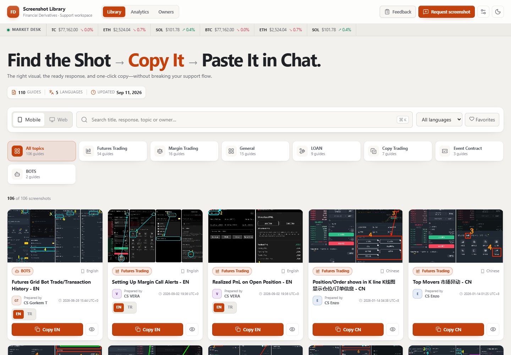

## What this project is

FD Screenshot Library gives customer-support agents one reliable place to find the right product screenshot, copy its prepared EN/TR response, and paste both into a customer chat. It also gives contributors a protected workspace for maintaining the catalog without passing files, access credentials, or spreadsheet versions between people.

The product shares the typography, color tokens, surface language, and interaction rhythm of FD Macro Generator, while remaining a distinct, image-first product. Its wider editorial navigation, category rail, visual inspector, owner identity colors, and gallery density are designed specifically for screenshot discovery.

The system has four connected surfaces:

| Surface | Purpose | Access |
| --- | --- | --- |
| Library | Search, filter, inspect, copy, and open screenshots | Public/team-wide |
| Request | Submit a missing screenshot request | Public/team-wide |
| Analytics workspace | Understand usage and manage request status | Owner; Requests also supports contributors |
| Content Studio | Create, edit, replace, archive, restore, and audit catalog content | Contributor/owner |

## Product highlights

- Fast fuzzy search across screenshot titles, categories, descriptions, and response text.
- Compact information-rich cards with category, language, owner, and copy actions.
- A full-image inspector that always fits unusually tall, wide, and multi-panel screenshots without cropping.
- EN/TR response switching and one-click copy behavior.
- Distinct prepared-by colors for every owner.
- Click/view/copy/request tracking for meaningful analytics.
- A shared request workflow with five statuses, assignments, notes, linked screenshots, and immutable history.
- Personal contributor access codes with per-person revocation, rotation, role controls, and audit trails.
- Safe concurrent editing: five people can work at the same time without silently overwriting each other.
- Image-replacement ownership transfer while text-only edits preserve the existing owner.
- Cloudflare D1 as live workflow state and GitHub as the deployable catalog/snapshot source of truth.
- Responsive light and dark modes with desktop and mobile layouts.

## Product tour

### 1. Find the right shot

The homepage opens with the editorial search surface, category shortcuts, compact library statistics, language controls, and screenshot cards. Search is fuzzy, so agents do not need to know the exact stored title.

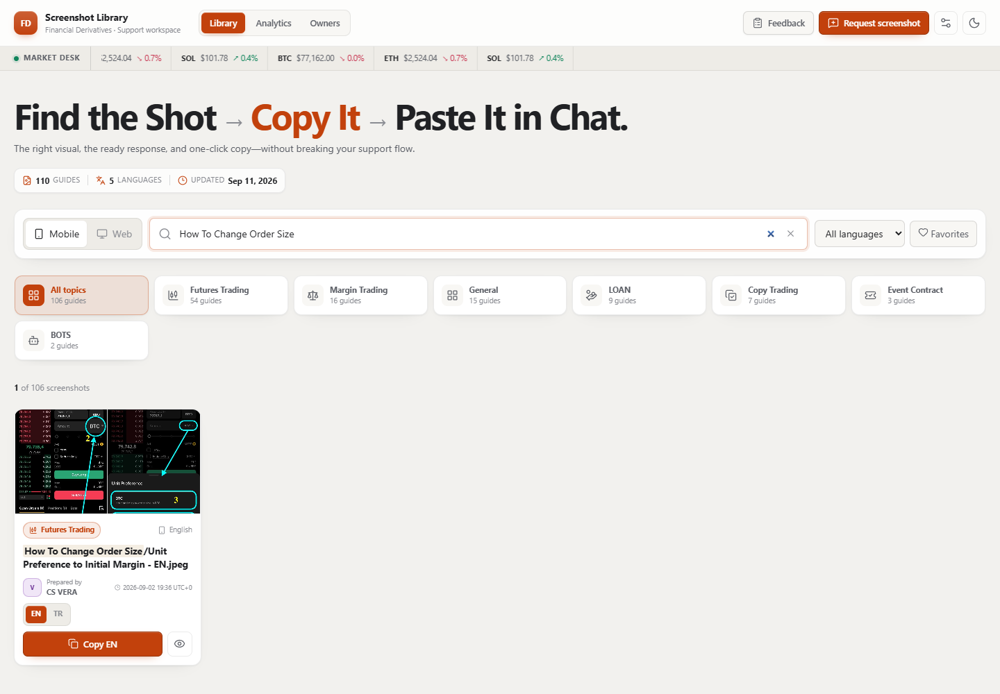

Typical flow:

1. Type a product term, action, or error phrase.
2. Narrow the result with a category or language filter.
3. Check the owner and available response language on the card.
4. Open the result for a complete preview or use the card’s quick actions.

### 2. Inspect the complete screenshot

The inspector uses **Fit** behavior by default. The entire screenshot stays centered in the available media pane with its original aspect ratio; the guidance column scrolls independently. The **Open image** action remains available for native-resolution inspection.

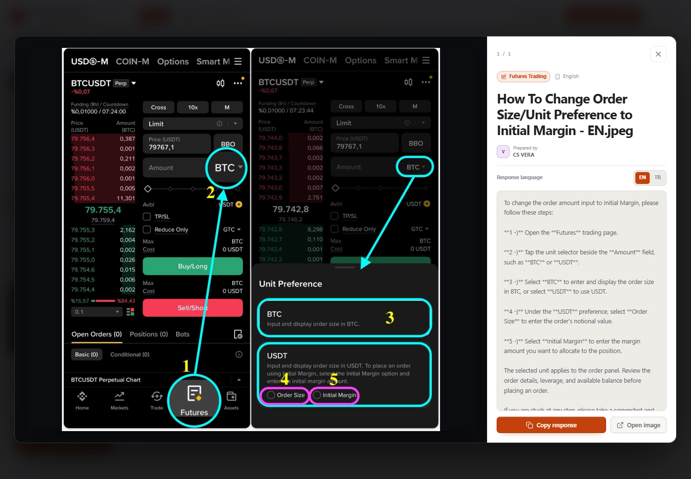

Opening the inspector records one meaningful screenshot-view event. Resizing, switching response language, or scrolling the detail pane does not create duplicate view events.

### 3. Copy the response and send it

Inside the inspector:

1. Select **EN** or **TR**.
2. Review the prepared response.
3. Copy the response with one click.
4. Open or copy the screenshot.
5. Paste both into the customer chat.

Copy events retain the screenshot record, owner, language, category, and timestamp dimensions needed by Analytics.

### 4. Request a missing screenshot

The public Request surface records the topic, requested language, platform, description, context, and useful search terms. Public users can submit a request but cannot set internal workflow fields such as assignee, resolution, linked record, or sync state.

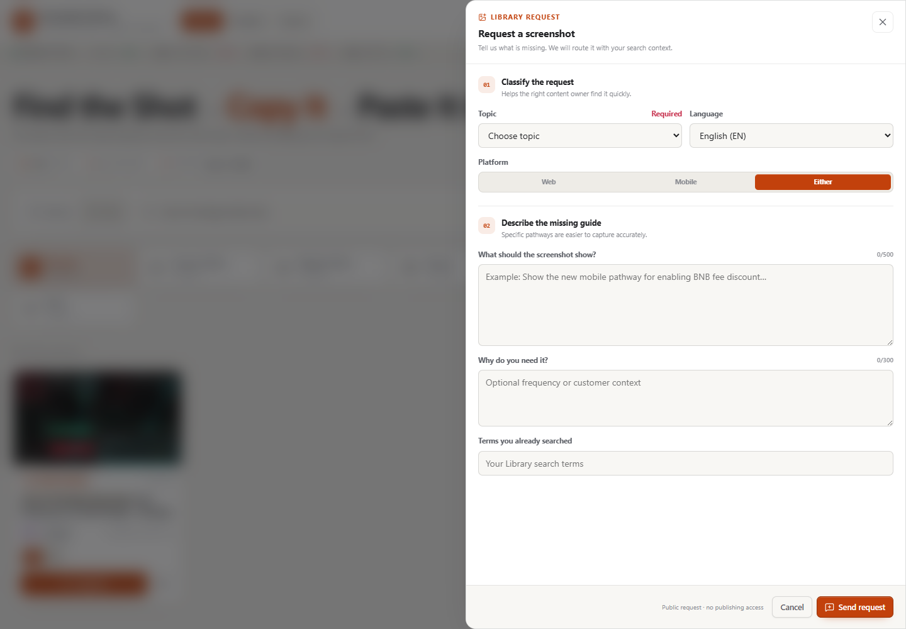

Server-side validation and rate limiting protect the endpoint. New submissions enter the shared workflow as `new`.

### 5. Review usage analytics

The Analytics overview summarizes library views, response copies, screenshot copies, search behavior, language usage, categories, and recent activity. It is designed to answer practical content questions: what agents use, what they cannot find, and which areas need maintenance.

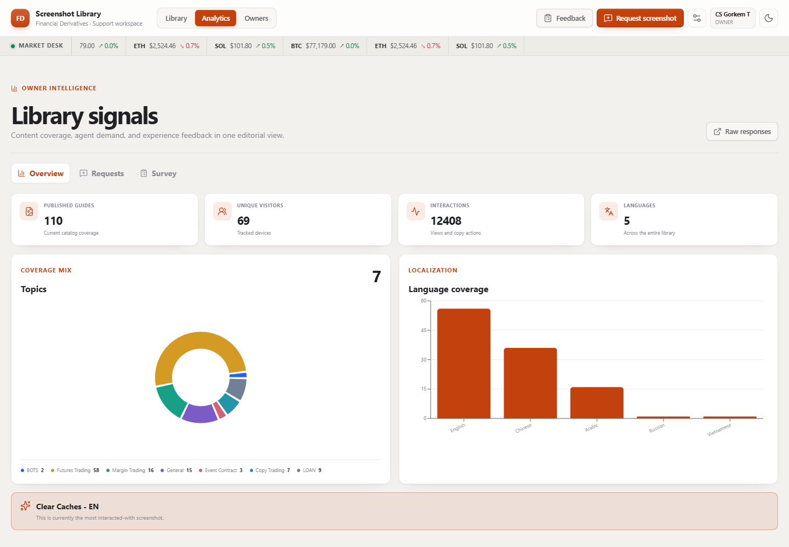

### 6. Manage the request workflow

Requests are not a read-only spreadsheet mirror. Contributors can search and filter requests, assign work, change status, add a resolution note, link the delivered screenshot, and inspect the immutable event history.

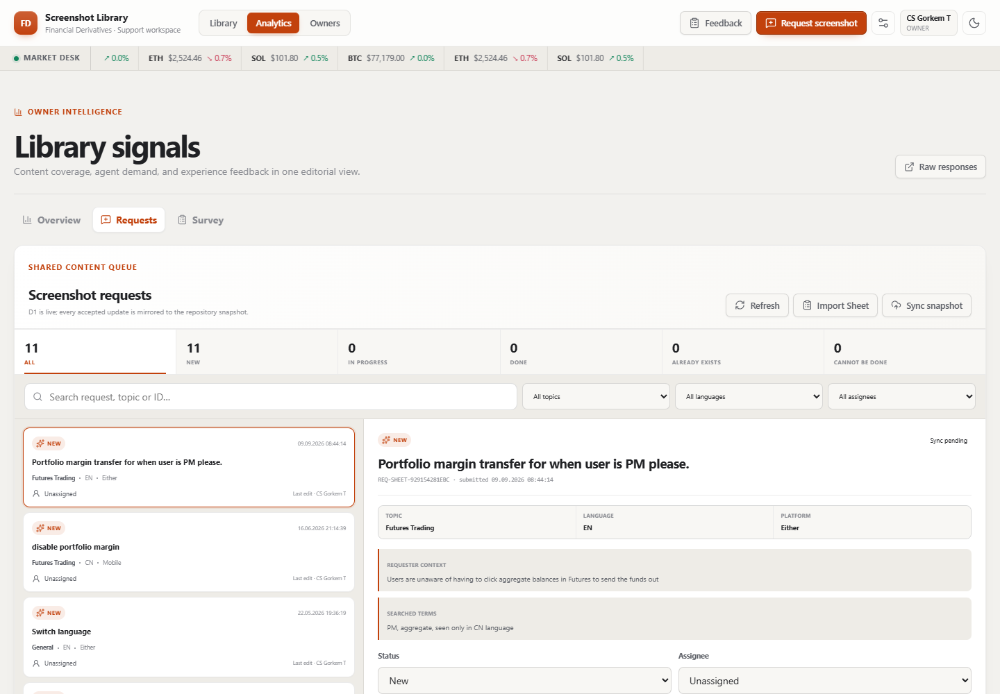

The canonical statuses are:

| Status | Meaning | Save requirement |
| --- | --- | --- |
| `new` | Untriaged request | None |
| `in_progress` | Someone is actively working on it | Assignee is optional but recommended |
| `done` | A new screenshot has been delivered | Published screenshot link required |
| `already_exists` | The requested content is already in the library | Existing screenshot link required |
| `cannot_be_done` | The request cannot be completed | Resolution note of at least 10 characters required |

Owners may reopen or correct any request. Every change appends an event containing the actor, before/after state, timestamp, request ID, and idempotency key.

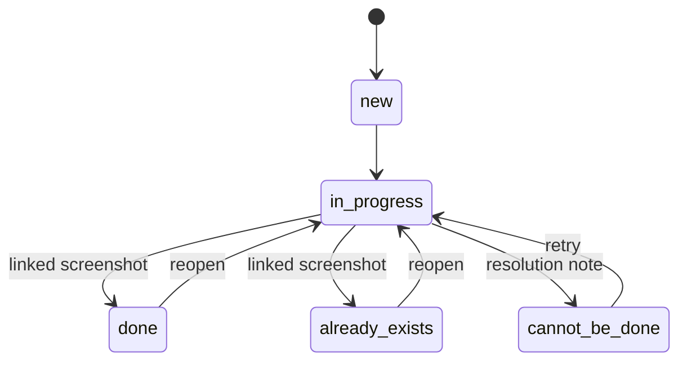
```mermaid
stateDiagram-v2
    [*] --> new
    new --> in_progress
    in_progress --> done: linked screenshot
    in_progress --> already_exists: linked screenshot
    in_progress --> cannot_be_done: resolution note
    done --> in_progress: reopen
    already_exists --> in_progress: reopen
    cannot_be_done --> in_progress: retry
```

### 7. Preserve every owner’s contribution

The Owners page separates current ownership, lifetime contribution, credited views/copies, and recent publishing activity. The current migrated catalog contains 110 attributed records:

| Owner | Current screenshots |
| --- | ---: |
| CS Gorkem T | 40 |
| CS Enzo | 36 |
| CS VERA | 34 |

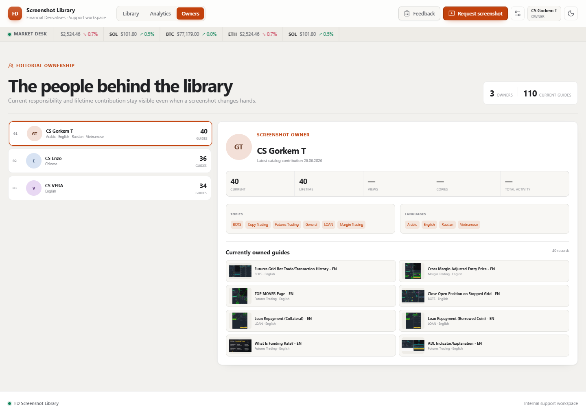

Historical EN and unnamed-language records belong to **CS Gorkem T**; CN records belong to **CS Enzo**; the existing **CS VERA** records keep their preserved attribution. The migration is idempotent and never takes records away from Vera.

Ownership follows one clear rule:

- Replacing the actual image transfers current ownership to the authenticated contributor.
- Editing only titles, descriptions, categories, or EN/TR response text does **not** transfer ownership.
- Archive, restore, and audit history do not erase earlier contribution intervals.

Each catalog record therefore retains both the current compatibility fields and an interval-based history:

```json
{
  "owner": "CS Gorkem T",
  "ownerKey": "cs-gorkem-t",
  "ownerSince": "2026-09-12T18:45:00.000Z",
  "ownerHistory": [
    {
      "ownerKey": "cs-vera",
      "owner": "CS VERA",
      "from": "2026-06-01T10:00:00.000Z",
      "to": "2026-09-12T18:45:00.000Z",
      "reason": "image-replaced",
      "changedBy": "contributor-id"
    },
    {
      "ownerKey": "cs-gorkem-t",
      "owner": "CS Gorkem T",
      "from": "2026-09-12T18:45:00.000Z",
      "to": null,
      "reason": "image-replaced",
      "changedBy": "contributor-id"
    }
  ]
}
```

Usage attribution resolves modern events by `recordId` first and then chooses the owner interval containing the event timestamp. Legacy rows without `recordId` use normalized exact-title matching. Ambiguous matches are skipped and reported rather than credited to the wrong person.

### 8. Maintain content in Content Studio

Content Studio is the protected catalog workspace. It shows the live catalog, quick search, current owner, revision, sync state, archived records, and audit activity.

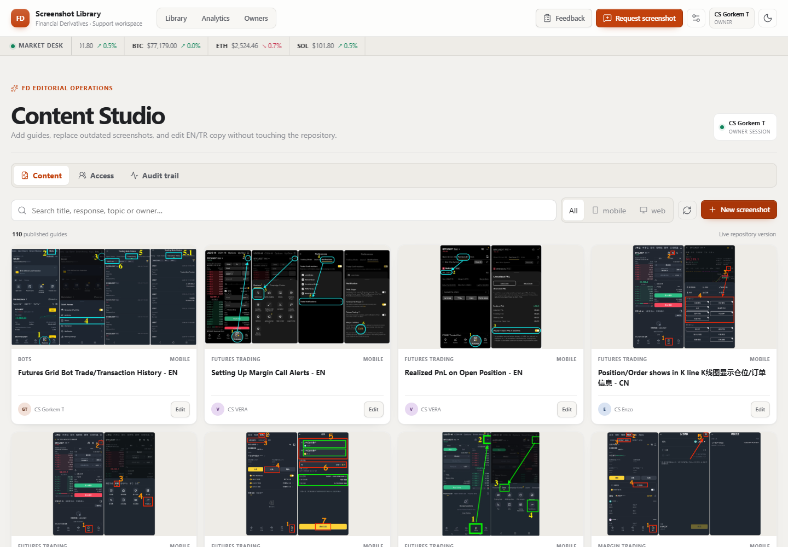

Contributors can:

- use **Replace existing** to search the catalog by title, owner, topic, language, or platform before opening an update;
- use **Create new** for a genuinely new screenshot record, without a misleading empty current-image panel;
- edit titles, categories, descriptions, and EN/TR guidance;
- compare the selected current image and replacement preview side by side while keeping the stable record identity;
- see the exact ownership consequence before publishing;
- resolve field-level conflicts;
- inspect their own recent audit activity.

If **Create new** was opened by mistake, **Choose existing** switches directly to the published screenshot selector. Selecting the original record preserves its record ID, analytics history, conflict version, and ownership timeline.

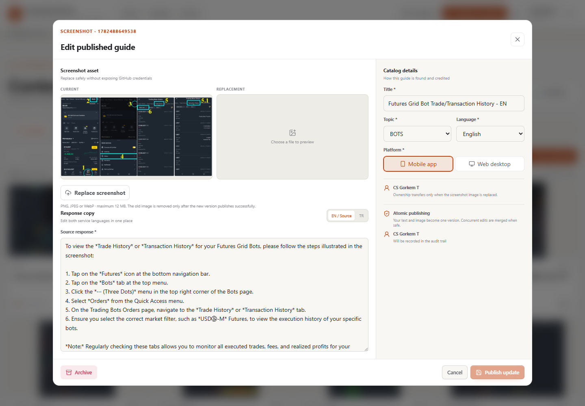

Catalog publishing is atomic. The Worker commits the updated image and `src/data/data.json` together, so a replacement cannot leave the repository with new metadata pointing at a missing asset.

### 9. Give each contributor personal access

Owners create a named contributor, choose the role, and receive a one-time personal access code. Codes can be rotated, disabled, and re-enabled independently. The audit trail records which authenticated person performed each mutation.

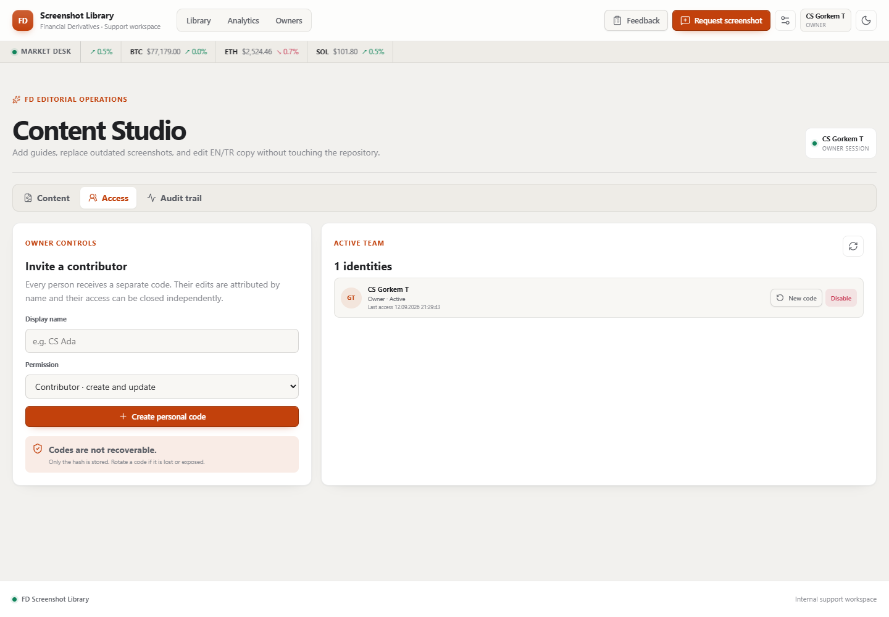

| Capability | Contributor | Owner |
| --- | :---: | :---: |
| Search/copy/inspect library | ✓ | ✓ |
| Create and edit catalog content | ✓ | ✓ |
| Replace an image | ✓ | ✓ |
| Update request workflow | ✓ | ✓ |
| Analytics overview | — | ✓ |
| Owners analytics | — | ✓ |
| Import historical Sheet requests | — | ✓ |
| Manage contributor access | — | ✓ |
| Archive/restore and retry repository sync | — | ✓ |

Access codes are stored as secure hashes. GitHub credentials remain Worker-only secrets and never reach the browser.

### 10. Use the library on mobile

The search, categories, cards, inspector, request flow, theme, and language controls adapt to small screens without horizontal overflow.

<p align="center">
  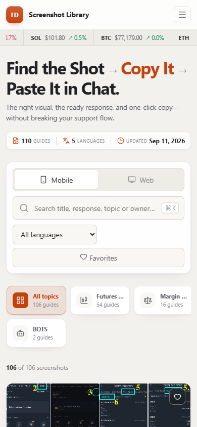
</p>

## Request persistence and Sheet history

Cloudflare D1 is the live operational request store. After each accepted create or update, the `RequestWriter` Durable Object serializes the mutation, writes the record and event history, rebuilds the visible snapshot, and publishes `src/data/requests.json` to GitHub.

Connected clients see D1 changes immediately. The repository snapshot lets every future deployment converge on the same request state and acts as a read-only fallback when the Worker is temporarily unavailable.

The one-time historical import reads the configured Google Apps Script request endpoint. Every Sheet row receives a stable digest from normalized source fields:

```text
submitted_at | device_hash | topic | language | platform | description
```

The unique `(source, source_key)` constraint makes repeated imports safe. An existing request with workflow edits is never reset by a later import. The current verified baseline imports 11 historical rows; a second run reports all 11 as existing and inserts zero duplicates.

Survey data remains read-only and outside the mutable request workflow.

## Safe concurrent editing

Every request and catalog mutation includes an idempotency key plus the version/revision the editor started from. Durable Objects serialize writes independently of how many browsers submit them at once.

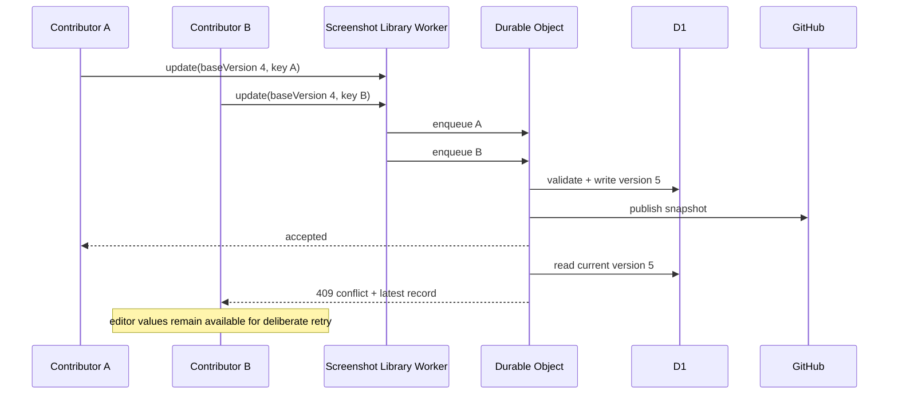
```mermaid
sequenceDiagram
    participant A as Contributor A
    participant B as Contributor B
    participant API as Screenshot Library Worker
    participant DO as Durable Object
    participant DB as D1
    participant GH as GitHub

    A->>API: update(baseVersion 4, key A)
    B->>API: update(baseVersion 4, key B)
    API->>DO: enqueue A
    API->>DO: enqueue B
    DO->>DB: validate + write version 5
    DO->>GH: publish snapshot
    DO-->>A: accepted
    DO->>DB: read current version 5
    DO-->>B: 409 conflict + latest record
    Note over B: editor values remain available for deliberate retry
```

For catalog edits, non-overlapping fields can be merged against the latest revision. Overlapping changes return an explicit conflict instead of silently choosing a winner. Five simultaneous verified submissions are accepted and processed without corrupting shared state.

If GitHub is temporarily unavailable, an already accepted D1 request is not rolled back. It is marked `sync_pending`; owners can retry publishing the repository snapshot later.

## System architecture

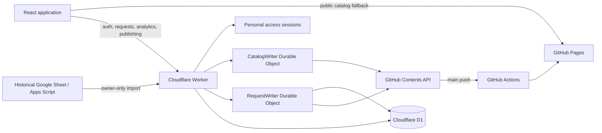
```mermaid
flowchart LR
    Browser[React application] -->|public catalog fallback| Pages[GitHub Pages]
    Browser -->|auth, requests, analytics, publishing| Worker[Cloudflare Worker]
    Worker --> Auth[Personal access sessions]
    Worker --> CatalogDO[CatalogWriter Durable Object]
    Worker --> RequestDO[RequestWriter Durable Object]
    Worker --> D1[(Cloudflare D1)]
    CatalogDO --> GitHub[GitHub Contents API]
    RequestDO --> D1
    RequestDO --> GitHub
    GitHub -->|main push| Actions[GitHub Actions]
    Actions --> Pages
    Sheet[Historical Google Sheet / Apps Script] -->|owner-only import| Worker
```

### Sources of truth

| Data | Live source | Repository fallback/snapshot |
| --- | --- | --- |
| Screenshot catalog | GitHub `src/data/data.json` | Built copy in `dist/data.json` |
| Screenshot images | GitHub `public/screenshots/` | Deployed Pages assets |
| Contributor identities/sessions | Cloudflare D1 | None |
| Request workflow | Cloudflare D1 | `src/data/requests.json` |
| Request event history | Cloudflare D1 | Not exposed publicly |
| Usage analytics | Existing analytics service | Catalog metadata supports attribution |

The FD Screenshot Library Worker, D1 database, Durable Objects, and secrets are intentionally separate from FD Macro Generator.

## Technology stack

| Layer | Technology |
| --- | --- |
| Interface | React 19, React Router 7, Framer Motion |
| Build | Vite 7 |
| Search | Fuse.js |
| Charts | Recharts |
| Icons | Lucide React plus project-native category/platform marks |
| API | Cloudflare Workers, TypeScript |
| Live state | Cloudflare D1 |
| Write serialization | Cloudflare Durable Objects |
| Repository publishing | GitHub Contents API |
| Static hosting | GitHub Pages |
| Tests | Node test runner and Vitest |

## Project structure

```text
screenshot-library-main/
├─ .github/
│  ├─ assets/                     # README product screenshots
│  └─ workflows/deploy.yml        # GitHub Pages pipeline
├─ apps-script/
│  ├─ Code.gs                     # Existing request/survey service
│  └─ owner-analytics.gs          # Owner analytics processing
├─ docs/superpowers/
│  ├─ plans/                      # Approved implementation plans
│  └─ specs/                      # Product/architecture decisions
├─ public/
│  ├─ screenshots/                # Published screenshot assets
│  ├─ fd-logo.svg
│  └─ hero-branding.png
├─ scripts/
│  ├─ migrate-owners.mjs          # Current owner attribution migration
│  └─ migrate-owner-history.mjs   # Interval history migration
├─ src/
│  ├─ components/                 # Gallery, inspector, forms, shared UI
│  │  ├─ admin/                   # Studio, editor, audit, access management
│  │  └─ requests/                # Shared request workflow
│  ├─ contexts/                   # Auth, data, theme, modal state
│  ├─ data/
│  │  ├─ data.json                # Canonical catalog metadata
│  │  └─ requests.json            # Deployable request snapshot
│  ├─ domain/                     # Pure catalog/request/analytics logic
│  ├─ pages/                      # Library, Analytics, Owners, Studio
│  ├─ services/                   # Content API and analytics adapters
│  ├─ App.jsx
│  └─ index.css                   # Design system and responsive layout
├─ test/                          # Frontend/domain regression tests
├─ worker/
│  ├─ migrations/                 # D1 schema migrations
│  ├─ src/                        # API, auth, DO writers, GitHub publisher
│  ├─ test/                       # Worker unit/integration tests
│  └─ wrangler.toml               # Independent Cloudflare configuration
├─ package.json
└─ vite.config.js
```

## Local development

### Requirements

- Node.js 20 or newer
- npm
- A browser
- Wrangler/Cloudflare credentials only when testing real remote services

### 1. Install the frontend

```powershell
cd "C:\Users\user\Desktop\screenshort library\screenshot-library-main"
npm install
Copy-Item .env.example .env.local
```

Set the local Worker URL in `.env.local`:

```dotenv
VITE_CONTENT_API_URL=http://127.0.0.1:8787
```

### 2. Install and initialize the Worker

```powershell
npm install --prefix worker
cd worker
npx wrangler d1 migrations apply fd-screenshot-library --local
```

For local authentication, provide development-only values for `SESSION_SECRET`, `OWNER_BOOTSTRAP_CODE`, and `GITHUB_TOKEN`. Never commit these values. A dummy GitHub token is sufficient for interface work, but publishing actions will correctly remain pending/fail until a valid token is supplied.

Detailed Worker setup is documented in [`worker/README.md`](worker/README.md).

### 3. Run both processes

Terminal 1:

```powershell
cd worker
npm run dev
```

Terminal 2:

```powershell
npm run dev
```

Open:

- Library: `http://localhost:5173/screenshot-library/#/`
- Request: `http://localhost:5173/screenshot-library/#/request`
- Analytics: `http://localhost:5173/screenshot-library/#/analytics`
- Owners: `http://localhost:5173/screenshot-library/#/owners`
- Content Studio: `http://localhost:5173/screenshot-library/#/admin`
- Worker health: `http://127.0.0.1:8787/health`

### 4. Run the verification suite

```powershell
npm test
npm run lint
npm run build
npm test --prefix worker
npm run typecheck --prefix worker
npx wrangler deploy --dry-run --config worker/wrangler.toml
```

The verified baseline is 71 frontend tests and 27 Worker tests, plus lint, production build, Worker typecheck, and Wrangler dry-run.

### 5. Run data migrations safely

Both catalog migration scripts are idempotent:

```powershell
node scripts/migrate-owners.mjs
node scripts/migrate-owner-history.mjs
```

Review the Git diff after any migration. Re-running must not create duplicate ownership intervals or collide with Vera’s existing records.

## Production deployment

Deployment order matters because the frontend needs the final Worker URL.

### First-time Cloudflare setup

1. Authenticate Wrangler:

   ```powershell
   npx wrangler login
   ```

2. Create the dedicated D1 database if it does not already exist:

   ```powershell
   npx wrangler d1 create fd-screenshot-library
   ```

3. Replace the placeholder `database_id` in `worker/wrangler.toml` with the returned ID.
4. Apply remote migrations:

   ```powershell
   npx wrangler d1 migrations apply fd-screenshot-library --remote --config worker/wrangler.toml
   ```

5. Store production secrets interactively:

   ```powershell
   npx wrangler secret put GITHUB_TOKEN --config worker/wrangler.toml
   npx wrangler secret put SESSION_SECRET --config worker/wrangler.toml
   npx wrangler secret put OWNER_BOOTSTRAP_CODE --config worker/wrangler.toml
   ```

   The GitHub token needs repository content read/write permission for this repository. Use a strong, unique session secret and an owner bootstrap code that is not shared as a contributor code.

6. Deploy the independent Worker:

   ```powershell
   npm run deploy --prefix worker
   ```

7. Confirm `/health`, owner bootstrap login, catalog read, and request read against the deployed Worker.

### Import historical requests

After the Worker is live, sign in as an owner and trigger the owner-only Sheet import once. Verify the inserted/existing/invalid counters, then run it a second time to prove idempotency. Do not continue if the second import inserts duplicates.

### Configure and deploy GitHub Pages

1. Add the deployed Worker URL as the repository Actions variable `VITE_CONTENT_API_URL`.
2. Push the verified `main` branch.
3. GitHub Actions installs dependencies, builds with that API URL, uploads `dist`, and deploys GitHub Pages.
4. Wait for the **Deploy to GitHub Pages** workflow to finish successfully.
5. Run the production smoke checklist below.

The Vite base is `/screenshot-library/`; `vite.config.js` copies the canonical catalog and request fallback snapshots into the production bundle.

### Production smoke checklist

- Homepage, logo, theme, ticker, category icons, and responsive navigation render.
- Search returns expected catalog records.
- Tall and wide images remain fully visible in the inspector.
- EN/TR response switching and copy actions work.
- View/copy interactions appear in Analytics once, without duplicates.
- Public request submission creates a live D1 request.
- Contributor can sign in, update a request, and publish a text-only edit.
- Image replacement transfers ownership; text-only edit does not.
- Five concurrent non-conflicting edits complete without corrupting data.
- Owner can create, rotate, disable, and re-enable contributor access.
- Imported request count and owner totals match the verified baseline.
- GitHub snapshot sync reports `synced`; pending sync can be retried.

## Operational runbooks

### Replace an outdated screenshot

1. Sign in to Content Studio with a personal contributor code.
2. Choose **Replace existing**; do not use **Create new** for an updated version of a published guide.
3. Search by title, owner, topic, language, or platform and select the existing record.
4. Verify the current owner, then choose **Choose replacement image**.
5. Compare the current and replacement previews side by side.
6. Confirm titles, category, platform, language, and response copy.
7. Review the ownership-transfer notice and publish the changes.
8. Open the public inspector and confirm the complete new asset is visible.

### Make a text-only correction

1. Open the record in Content Studio.
2. Edit only metadata or guidance fields.
3. Publish and confirm that the owner did not change.
4. Verify the editor appears in the audit log.

### Complete a request

1. Open **Analytics → Requests**.
2. Assign the request and move it to `in_progress`.
3. Create or update the required catalog screenshot.
4. Return to the request, choose `done`, and link the published record.
5. Save and verify the event history plus repository sync state.

### Resolve an edit conflict

1. Read the latest server version shown by the conflict UI.
2. Compare each conflicting field with the editor’s preserved values.
3. Keep the latest value or deliberately reapply the intended change.
4. Submit against the refreshed revision. Never bypass version checks.

### Recover pending repository sync

1. Confirm the request/catalog mutation is present in D1.
2. Check Worker logs and GitHub token permissions.
3. Use the owner-only retry action.
4. Verify `sync_state` changes from `pending` to `synced` and the repository snapshot matches D1.

## Security and privacy

- The browser never receives a GitHub token or plaintext stored access code.
- Contributor codes are individually revocable and attributable.
- Role checks are enforced by the Worker, not only hidden in the interface.
- Public requests cannot choose assignees, completion state, resolution, or sync state.
- Login attempts are limited per hashed IP bucket; catalog and authenticated request-workflow publishing share a per-contributor limit.
- Mutations are validated server-side, idempotent, versioned, and audited.
- Contributor deletion/disablement never destroys historical authorship.
- Requester identity is stored as a hash where applicable.
- Allowed production origins are explicit in `worker/wrangler.toml`.
- FD Macro Generator infrastructure and credentials are not reused.

## Troubleshooting

| Symptom | Check |
| --- | --- |
| Catalog opens but Studio is offline | `VITE_CONTENT_API_URL`, Worker `/health`, allowed origin |
| Owner bootstrap login fails | `OWNER_BOOTSTRAP_CODE` secret and D1 migrations |
| Catalog/request update is pending | GitHub token permission, branch, repository settings, retry action |
| Request save returns `409` | Another editor updated it; refresh/resolve against latest version |
| `done` cannot be saved | Link a published screenshot record |
| `cannot_be_done` cannot be saved | Add a resolution note of at least 10 characters |
| Historical import repeats rows | Verify `(source, source_key)` migration and source normalization |
| An owner’s old usage is missing | Inspect `ownerHistory`, event timestamp, record ID, and collision report |
| Production can’t reach Worker | GitHub Actions variable, build logs, Worker URL, CORS origin |
| Local Studio shows GitHub error | Expected with a dummy local token; use a valid development token only when publishing is required |

## Design principles

- **Same family, different product:** familiar FD system language without copying Macro Generator’s page structure.
- **Editorial density:** more useful information in less space, with clear hierarchy instead of oversized decoration.
- **Visible ownership:** every contribution is credited, and every owner has a distinct identity color.
- **No silent data loss:** conflicts, pending sync, validation, and audit states are explicit.
- **Complete image first:** support screenshots must never be cropped in the main inspector.
- **Progressive access:** public discovery, contributor workflow, and owner administration stay clearly separated.

## Further documentation

- [`worker/README.md`](worker/README.md) — Worker endpoints, secrets, migrations, and security model
- [`DEPLOYMENT.md`](DEPLOYMENT.md) — existing GitHub Pages deployment notes
- [`docs/superpowers/specs/2026-09-12-fd-screenshot-library-ultimate-redesign-design.md`](docs/superpowers/specs/2026-09-12-fd-screenshot-library-ultimate-redesign-design.md) — visual/product direction
- [`docs/superpowers/specs/2026-09-12-home-density-and-tracking-refinement-design.md`](docs/superpowers/specs/2026-09-12-home-density-and-tracking-refinement-design.md) — density and event-tracking decisions
- [`docs/superpowers/specs/2026-09-12-request-workflow-and-owner-history-design.md`](docs/superpowers/specs/2026-09-12-request-workflow-and-owner-history-design.md) — request workflow, ownership history, and inspector-fit architecture

---

Built as a dedicated FD support workspace: **Find the Shot · Copy It · Paste It on the Chat!**
