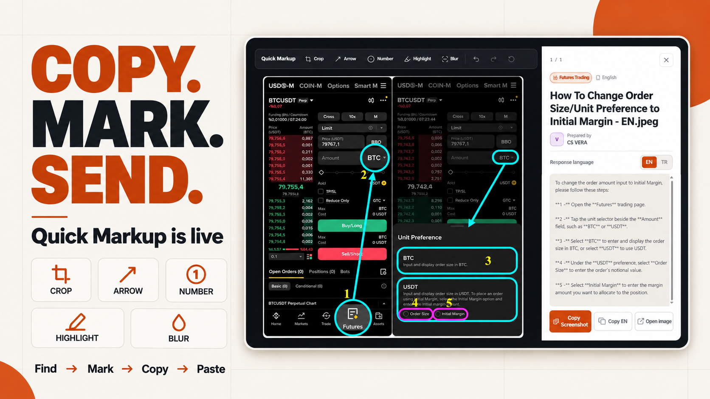

# Team announcement — Copy Screenshot + Quick Markup

## Ready to share

**A faster way to send the right screenshot is now live in FD Screenshot Library.**

You can now copy the screenshot itself directly from a card or from the full preview. The familiar **Copy EN/TR** buttons stay exactly where they are, so the full flow is simple: find the guide, copy the visual, copy the response, and paste both into the chat.

Need to make the visual clearer first? Open the screenshot and use **Quick Markup**:

- **Crop** — keep only the part the customer needs.
- **Arrow** — point to the exact button or field.
- **Number** — show the order of the steps.
- **Highlight** — frame the important area.
- **Blur** — hide sensitive or distracting information.
- **Undo / Redo / Reset** — change your mind safely.

Your edits are temporary and only affect the copy you send. The original library screenshot is never changed, and reopening the guide always gives you a clean version.

**Find the Shot → Mark It → Copy It → Paste It in Chat.**

Works on desktop and mobile. The Owners workspace counts screenshot copies and shows how many used Quick Markup, helping us see which visuals support the team most.
